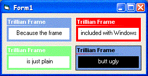

## Trillian Frame 2

### Description

Looks like the frame used in Trillian Pro 2. Why? Cause the frame included with windows is just plain ugly. Now uses variable colors, and corrects the gradient to match
 
### More Info
 

             |
---                |---
**Submitted On**   |2004-02-20 00:08:26
**By**             |[Techni Rei Myoko](https://github.com/Planet-Source-Code/PSCIndex/blob/master/ByAuthor/techni-rei-myoko.md)
**Level**          |Intermediate
**User Rating**    |3.1 (22 globes from 7 users)
**Compatibility**  |VB 6\.0
**Category**       |[Custom Controls/ Forms/  Menus](https://github.com/Planet-Source-Code/PSCIndex/blob/master/ByCategory/custom-controls-forms-menus__1-4.md)
**World**          |[Visual Basic](https://github.com/Planet-Source-Code/PSCIndex/blob/master/ByWorld/visual-basic.md)
**Archive File**   |[Trillian\_F1711062202004\.zip](https://github.com/Planet-Source-Code/techni-rei-myoko-trillian-frame-2__1-51797/archive/master.zip)

